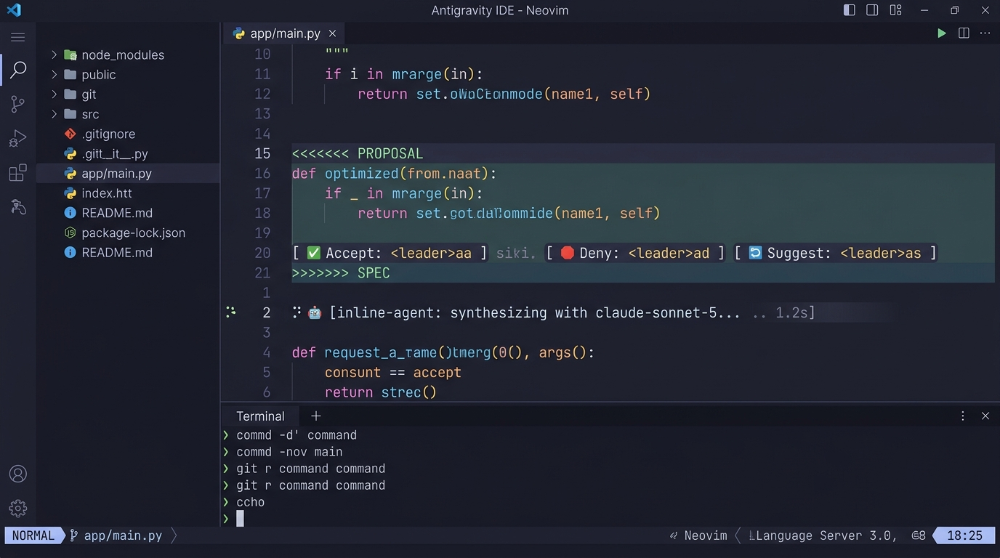

# Inline Spec-Driven Agentic Coding

A fast, transparent, and human-in-the-loop coding agent embedded directly in your editor buffers. Designed for **spec-driven / comment-driven development**:
1. You write the specification, intent, and constraints inline.
2. The agent synthesizes an implementation (and optionally a verified companion test suite) and presents an interactive **Review Frame**.
3. You **Accept**, **Deny**, or **Suggest Changes** directly in the buffer—without AI overwriting your code blindly.



---

## Installation

### 1. Global Tool Installation (CLI)

Install globally via `uv` or `pip`:

```bash
# Recommended with uv (instant & isolated)
uv tool install .

# Or editable install for local development
uv tool install --editable .

# Or with pip
pip install -e .
```

`inline-agent` will now be available globally in your PATH (`~/.local/bin/inline-agent`) and can be executed against **any file in any folder on your computer**.

### 2. Neovim Plugin Setup

The companion plugin provides live inline animated Braille spinners and interactive virtual text. Copy `inline_agent.lua` to your Neovim config (e.g. `~/.config/nvim/lua/custom/plugins/inline_agent.lua`):

```lua
-- In your init.lua or plugin manager (lazy.nvim / pckr)
require("custom.plugins.inline_agent").setup({
  backend = "agy", -- or "claude", "openai", "codex"
  model = nil,     -- optional model override
})
```

---

## Swappable AI Backends

`inline-agent` supports multiple AI engines with zero extra heavy third-party dependencies. Direct API calls use Python's standard library with live streaming SSE:

| Backend | Flag / Value | Default Fast Model | Default Reasoning Model | Auth / Setup |
|---|---|---|---|---|
| **Google Antigravity** | `--backend agy` | `gemini-3.8-flash-high` | `claude-sonnet-4-6` | `agy` CLI in PATH |
| **Anthropic Claude** | `--backend claude` | `claude-sonnet-5` | `claude-opus-5` | `export ANTHROPIC_API_KEY=...` or `claude` CLI |
| **OpenAI / Codex** | `--backend openai` | `gpt-5.6-luna` | `gpt-5.6-sol` | `export OPENAI_API_KEY=...` or `openai` CLI |
| **Custom Command** | `--backend custom` | Custom | Custom | `--cmd "my-llm -m ..."` or `INLINE_AGENT_CMD` |

### Switching Backends

1. **Via CLI flags:**
   ```bash
   inline-agent --backend claude --model claude-opus-5 path/to/file.py
   inline-agent --backend openai --model gpt-5.6-sol path/to/file.go
   ```

2. **Via Environment Variables:**
   ```bash
   export INLINE_AGENT_BACKEND="claude"
   export INLINE_AGENT_MODEL="claude-opus-5"
   ```

3. **Inside Neovim:**
   - `:InlineBackend claude` / `:InlineBackend openai` / `:InlineBackend agy`
   - `:InlineModel gpt-5.6-sol`

4. **Auto-Detection:**
   If no backend is specified, `inline-agent` auto-detects in priority order:
   `agy` CLI -> `ANTHROPIC_API_KEY` / `claude` CLI -> `OPENAI_API_KEY` / `openai` CLI.

---

## Works on Any Computer File & Folder

`inline-agent` automatically climbs parent directories starting from your target file to discover the project root (searching for `.git`, `pyproject.toml`, `package.json`, `go.mod`, `Cargo.toml`, `mix.exs`, `Gemfile`, or `AGENTS.md`).

Whether you run it from `~`, `/tmp`, or inside a subpackage:
```bash
# Works from anywhere on the computer
inline-agent ~/projects/backend/src/services/auth.py

# Automatically discovers context, sibling files, and creates companion tests in the right directory
inline-agent --test /path/to/any/project/cache.go
```

---

## Supported Languages & Syntax

Supports Python, Go, TypeScript/JavaScript, Rust, Lua, Ruby, and Elixir out of the box with language-specific AST/compiler validation:

| Language | Ext | Comment Syntax | Syntax Validator | Test Runner | Companion Test Path |
|---|---|---|---|---|---|
| **Python** | `.py` | `#[ai]` ... `#[run]` or `@ai(run=True)` | `ast.parse` | `unittest` | `test_{name}.py` |
| **Go** | `.go` | `// [ai]` ... `// [run]` | `gofmt -e` | `go test -v` | `{name}_test.go` |
| **TypeScript / JS** | `.ts`, `.js` | `// [ai]` ... `// [run]` | `bun` / `node --check` | `bun test` | `{name}.test.ts` |
| **Rust** | `.rs` | `// [ai]` ... `// [run]` | `cargo check` | `cargo test` | `{name}_test.rs` |
| **Lua** | `.lua` | `-- [ai]` ... `-- [run]` | `luac -p` | `lua` | `{name}_spec.lua` |
| **Ruby** | `.rb` | `#[ai]` ... `#[run]` | `ruby -c` | `ruby -I.` | `test_{name}.rb` |
| **Elixir** | `.ex`, `.exs` | `#[ai]` ... `#[run]` | `Code.string_to_quoted!` | `elixir -r` | `{name}_test.exs` |

---

## Localized Review Frames (Targeted Diffs)

The review frame is **diff-localized**: when modifying an existing file with stubs or directives, untouched surrounding code is preserved outside the review frame. Only the targeted function or block being generated is wrapped:

```lua
local M = {}

function M.existing_helper()
  return 42
end

<<<<<<< PROPOSAL (Lua Implementation - Click 'Accept Current Change' to keep)
function M.multiply(a, b)
  return a * b
end
=======
-- [ai]: implement multiply function
-- [run]
>>>>>>> SPEC (Original Intent - Click 'Accept Incoming Change' to revert)

function M.another_existing_helper()
  return "hello"
end

return M
```

---

## Companion Test Co-Generation (`--test` / `[ai:test]`)

The agent can generate both the production code and a companion unit test suite simultaneously:

```python
# [ai:test] Thread-safe Token Bucket Rate Limiter
# Implement TokenBucketRateLimiter(rate_per_sec: float, capacity: int)
# methods: acquire(tokens=1) -> bool, available_tokens -> float
# [run]
```

### Self-Healing Test Loop
1. Generates implementation and companion test (e.g. `rate_limiter.py` and `test_rate_limiter.py`).
2. Validates AST/syntax for both files.
3. Runs the test suite in the background (`python -m unittest`, `go test`, `bun test`, etc.).
4. If tests fail, initiates an automated self-repair loop feeding test error traces back to the reasoning model.
5. Emits the review frame only after tests compile and pass!
6. If you **Accept**, the implementation and passing tests remain in place. If you **Deny**, the companion test is cleanly removed.

---

## Editor Integrations

### 1. Neovim Keybindings & Commands
- **Live Inline Animation**: During synthesis, an animated Braille spinner with elapsed seconds spins directly at the directive line (`⠋ 🤖 [inline-agent: synthesizing... 1.4s]`), flashing a confirmation badge upon completion.
- **Interactive Virtual Text**: Directly above each localized proposal:
  `[ ✔ Accept: <leader>aa ] [ 🛑 Deny: <leader>ad ] [ 🔄 Suggest: <leader>as ]`
- **Keybindings:**
  - `]a`: Jump to next proposal in buffer
  - `[a`: Jump to previous proposal in buffer
  - `<leader>aa`: Accept proposal (cursor-scoped or all in buffer)
  - `<leader>ad`: Deny proposal (cursor-scoped or all in buffer)
  - `<leader>as`: Prompt for human critique/feedback and re-propose
  - `<leader>ap`: Propose implementation for current buffer (or selected lines in Visual mode `V`)
  - `<leader>at`: Propose implementation + verified companion tests (or selected lines in Visual mode `V`)
  - `<leader>ac`: Propose with explicit context constraint files prompt

### 2. Antigravity IDE / VS Code
Native buttons automatically float above the localized review frame:
- **`Accept Current Change`**: Keeps the AI implementation and companion tests.
- **`Accept Incoming Change`**: Restores your human spec and cleans up tests.
- **`Compare Changes`**: Opens a side-by-side split diff.

---

## Visual Selection / Line Ranges

Run only on a specific selection without touching the rest of the file:
- **In Neovim**: Highlight lines in visual mode (`V`), then press `<leader>ap` (or `<leader>at` for tests).
- **In Neovim command**: `:'<,'>InlineProposeRange` or `:15,30InlineProposeRange`
- **Via CLI**: `inline-agent path/to/file.lua --range 15:30`

---

## Context Constraints & Explicit File Grounding

Ground the AI with specific files and type definitions:

### 1. In-Comment Mentions (`@file` or `@[file]`)
Mention other files directly in your spec:
```python
# [ai] @schema.py @[weather.go]
# Implement reporter using ToolSchemaOutput from schema.py
# [run]
```

### 2. Via CLI or Neovim
- **CLI**: `inline-agent file.py --context schema.py,weather.go`
- **Neovim**: Press `<leader>ac` and enter comma-separated filenames.

---

## CLI Reference

```bash
# Positional shortcut (runs --once on target file)
inline-agent path/to/file.py

# Run with companion tests
inline-agent --test path/to/file.go

# Swap AI backend and model
inline-agent --backend claude --model claude-opus-5 path/to/file.rs
inline-agent --backend openai --model gpt-5.6-sol path/to/file.ts

# Target line range
inline-agent path/to/file.py --range 20:45

# Explicit context constraints
inline-agent path/to/file.py --context schema.py,models.py

# Daemon watcher mode (watches project for [run] directives)
inline-agent
inline-agent --path /path/to/project

# Review Frame actions
inline-agent --accept path/to/file.py
inline-agent --deny path/to/file.py
inline-agent --suggest path/to/file.py --note "Use a Binary Heap instead"
```

Sample specs for all supported languages are available in the [examples/](file:///Users/monkmode/projects/inline/examples) directory.
